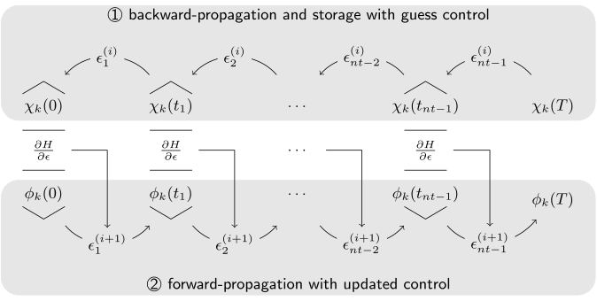

.. _KrotovsMethod:

Krotov’s Method
===============

The quantum control problem
---------------------------

Quantum optimal control methods formalize the problem of finding
"control fields" that steer the time evolution of a quantum system in
some desired way. For closed systems, described by a Hilbert space state
:math:`\ket{\Psi(t)}`, this time evolution is given by the Schrödinger
equation,

.. math::

   \frac{\partial}{\partial t} \Ket{\Psi(t)}
     = -\frac{\mathrm{i}}{\hbar} \Op{H}(t)\Ket{\Psi(t)}\,,

where the Hamiltonian :math:`\Op{H}(t)` depends on one or more control
fields :math:`\{\epsilon_l(t)\}`. We often assume the Hamiltonian to be
linear in the controls,

.. math::

   \Op{H}(t)
     = \Op{H}_0 + \epsilon_1(t) \Op{H}_1 + \epsilon_2(t) \Op{H}_2 + \dots

but non-linear couplings may also occur, for example when considering
non-resonant multi-photon transitions. For open quantum systems
described by a density matrix :math:`\hat{\rho}(t)`, the
Liouville-von-Neumann equation

.. math::

   \frac{\partial}{\partial t} \hat{\rho}(t)
   = \frac{1}{\hbar} \Liouville(t) \hat{\rho}(t)

replaces the Schrödinger equation, with the (non-Hermitian) Liouvillian
:math:`\Liouville(t)`.
The most direct example of a control problem is a state-to-state transition.
The objective is for a known quantum state :math:`\ket{\phi}` at time
zero to evolve to a specific target state :math:`\ket{\phi^\tgt}` at
final time :math:`T`, controlling, e.g. a chemical
reaction :cite:`TannorJCP1985`.
Another example is the
realization of quantum gates, the building blocks of a quantum computer.
In this case, the states forming a computational basis must transform
according to a unitary transformation :cite:`NielsenChuang`,
see :ref:`HowtoGateOptimization`. Thus, the
control problem involves not just the time evolution of a single state,
but a set of states :math:`\{\ket{\phi_k(t)}\}`. Generalizing even
further, each state :math:`\ket{\phi_k(t)}` in the control problem may
evolve under a different Hamiltonian
:math:`\Op{H}_k(\{\epsilon_l(t)\})`, see :ref:`HowtoRobustOptimization`.

Physically, the control fields :math:`\{\epsilon_l(t)\}` might be the
amplitudes of a laser pulse for the control of molecular systems or
trapped atom/ion quantum computers, radio-frequency fields for nuclear
magnetic resonance, or microwave fields for superconducting circuits.
When there are multiple independent controls :math:`\{\epsilon_l(t)\}`
involved in the dynamics, these may correspond e.g., to different color
lasers used in the excitation of a Rydberg atom, or different
polarization components of an electric field.

The quantum control methods build on a rich field of classical control
theory :cite:`BellmanBook,PontryaginBook`. This includes
Krotov's method :cite:`KrotovEC1983,KrotovCC1988,Krotov.book,KonnovARC99`,
which was originally formulated to optimize the soft landing of a
spacecraft from orbit to the surface of a planet, before being applied
to quantum mechanical
problems :cite:`Tannor92,SomloiCP1993,BartanaJCP1997,SklarzPRA2002,ReichJCP12`.
Fundamentally, they rely on the variational principle, that is, the
minimization of a functional
:math:`J[\{\ket{\phi_k^{(i)}(t)}\}, \{\epsilon_l^{(i)}(t)\}]` that
includes any required constraints via Lagrange multipliers. The
condition for minimizing :math:`J` is then
:math:`\nabla_{\phi_k, \epsilon_l} J = 0`. In rare cases, the
variational calculus can be solved in closed form, based on Pontryagin's
maximum principle :cite:`PontryaginBook`. Numerical methods
are required in any other case. These start from an initial guess
control (or set of guess controls, if there are multiple controls), and
calculate an update to these controls that will decrease the value of
the functional. The updated controls then become the guess for the next
iteration of the algorithm, until the value of the functional is
sufficiently small, or convergence is reached.

Optimization functional
-----------------------

Mathematically, Krotov's method, when applied to quantum
systems :cite:`Tannor92,ReichJCP12`, minimizes a functional
of the most general form

.. math::
   :label: functional

   J[\{\ket{\phi_k^{(i)}(t)}\}, \{\epsilon_l^{(i)}(t)\}]
       = J_T(\{\ket{\phi_k^{(i)}(T)}\})
           + \sum_l \int_0^T g_a(\epsilon_l^{(i)}(t)) \dd t
           + \int_0^T g_b(\{\phi^{(i)}_k(t)\}) \dd t\,,

where the :math:`\{\ket{\phi_k^{(i)}(T)}\}` are the time-evolved
initial states :math:`\{\ket{\phi_k}\}` under the controls
:math:`\{\epsilon^{(i)}_l(t)\}` of the :math:`i`\ 'th iteration. In the
simplest case of a single state-to-state transition, the index :math:`k`
vanishes. For the example of a two-qubit quantum gate,
:math:`\{\ket{\phi_k}\}` would be the logical basis states
:math:`\ket{00}`, :math:`\ket{01}`, :math:`\ket{10}`, and
:math:`\ket{11}`, all evolving under the same Hamiltonian
:math:`\Op{H}_k \equiv \Op{H}`. The sum over :math:`l` vanishes if there
is only a single control. For open system dynamics, the states
:math:`\{\ket{\phi_k}\}` may be density matrices.

The functional consists of three parts:

-  A final time functional :math:`J_T`. This is the "main" part of the
   functional, and we can usually think of :math:`J` as being an
   auxiliary functional in the optimization of :math:`J_T`.

-  A running cost on the control fields, :math:`g_a`. The most commonly
   used expression (and the only one currently supported by the
   :mod:`krotov` package) is :cite:`PalaoPRA2003`

   .. math::
      :label: g_a

      \begin{split}
          g_a(\epsilon_l^{(i)}(t))
          &= \frac{\lambda_{a,l}}{S_l(t)} \left(
              \epsilon_l^{(i)}(t) - \epsilon_{l, \text{ref}}^{(i)}(t)
            \right)^2\,;
            \quad
          \epsilon^{(i)}_{l, \text{ref}}(t) = \epsilon_l^{(i-1)}(t)\\
         &= \frac{\lambda_{a,l}}{S_l(t)} \left( \Delta\epsilon_l^{(i)}(t) \right)^2
         \,,
        \end{split}

   with the inverse "step width" :math:`\lambda_{a,l} > 0`, the "update
   shape" function :math:`S_{l}(t) \in [0, 1]`, and the :ref:`IterativeControlUpdate`

   .. math::
      :label: update

      \Delta\epsilon_l^{(i)}(t)
      \equiv \epsilon_l^{(i)}(t) - \epsilon_l^{(i-1)}(t)\,,

   where :math:`\epsilon_l^{(i-1)}(t)` is the optimized control of the
   previous iteration – that is, the guess control of the current
   iteration :math:`(i)`.

-  An optional state-dependent running cost, :math:`g_b`. This may be
   used to encode time-dependent control
   targets :cite:`KaiserJCP2004,SerbanPRA2005`, or to penalize population in a
   subspace :cite:`PalaoPRA2008`. The presence of a
   state-dependent constraint in the functional entails an inhomogeneous
   term in the backward propagation in the calculation of the control
   updates in each iteration of Krotov's method, see Eq. :eq:`bw_eqm`, and is
   currently not supported by the :mod:`krotov` package. Penalizing
   population in a subspace can also be achieved through simpler methods
   that do not require a :math:`g_b`, e.g., by using a non-Hermitian
   Hamiltonian to remove population from the forbidden subspace during
   the time evolution.

The most commonly used final-time functionals (cf. :mod:`krotov.functionals`)
optimize for a set of initial states :math:`\{\ket{\phi_k}\}` to evolve to a
set of target states :math:`\{\ket{\phi_k^\tgt}\}`.  The functionals can then
be expressed in terms of the complex overlaps of the target states with the
final-time states under the given control. Thus,

.. math::
   :label: tauk

     \tau_k = \Braket{\phi_k^\tgt}{\phi_k(T)}

in Hilbert space, or

.. math::

     \tau_k
     = \langle\!\langle \Op{\rho}^{\tgt} \vert \Op{\rho}_k(T) \rangle\!\rangle
     \equiv \tr\left[\Op{\rho}_k^{\tgt\,\dagger} \Op{\rho}_k(T) \right]

in Liouville space.

The following functionals :math:`J_T` can be formed from these complex
overlaps, taking into account that any optimization functional :math:`J_T` must
be real. They differ by the way they treat the phases :math:`\varphi_k` in the
physical optimization goal :math:`\ket{\phi_k(T)} \overset{!}{=}
e^{i\varphi_k}\ket{\phi_k^{\tgt}}` :cite:`PalaoPRA2003`:

* Optimize for simultaneous state-to-state transitions, with completely
  arbitrary phases :math:`\varphi_k`,

  .. math::
      :label: JTss

      J_{T,\text{ss}} = 1- \frac{1}{N} \sum_{k=1}^{N} \Abs{\tau_k}^2\,,

  cf. :func:`.J_T_ss`.

* Optimize for simultaneous state-to-state transitions, with an arbitrary
  *global* phase, i.e., :math:`\varphi_k = \varphi_{\text{global}}` for all
  :math:`k` with arbitrary :math:`\varphi_{\text{global}}`,

  .. math::
      :label: JTsm

      J_{T,\text{sm}} = 1- \frac{1}{N^2} \Abs{\sum_{k=1}^{N} \tau_k}^2
              = 1- \frac{1}{N^2} \sum_{k=1}^{N} \sum_{k'=1}^{N} \tau_{k'}^* \tau_{k}\,,

  cf. :func:`.J_T_sm`.

* Optimize for simultaneous state-to-state transitions, with a global phase of zero, i.e.,
  :math:`\varphi_k = 0` for all :math:`k`,

  .. math::
      :label: JTre

      J_{T,\text{re}} = 1-\frac{1}{N} \Re \left[\, \sum_{k=1}^{N} \tau_k \,\right]\,,

  cf. :func:`.J_T_re`.

.. _IterativeControlUpdate:

Iterative control update
------------------------

Starting from the initial guess control :math:`\epsilon_l^{(0)}(t)`, the
optimized field :math:`\epsilon_l^{(i)}(t)` in iteration :math:`i > 0`
is the result of applying a control update,

.. math::
   :label: eps_update

   \epsilon_l^{(i)}(t)
   = \epsilon_l^{(i-1)}(t) + \Delta\epsilon_l^{(i)}(t)\,.

Krotov's method is a clever construction of a particular
:math:`\Delta\epsilon_l^{(i)}(t)` that ensures

.. math::

   J[\{\ket{\phi_k^{(i)}(t)}\}, \{\epsilon_l^{(i)}(t)\}] \leq
     J[\{\ket{\phi_k^{(i-1)}(t)}\}, \{\epsilon_l^{(i-1)}(t)\}]\,.

Krotov's solution for :math:`\Delta\epsilon_l^{(i)}(t)` is given in
below (:ref:`FirstOrderUpdate` and :ref:`SecondOrderUpdate`).
As shown there,
for the specific running cost of Eq. :eq:`g_a`, using the
guess control field :math:`\epsilon_l^{(i-1)}(t)` as the "reference"
field, the update :math:`\Delta\epsilon^{(i)}_l(t)` is proportional to
:math:`\frac{S_l(t)}{\lambda_{a,l}}`. Note that this also makes
:math:`g_a` proportional to :math:`\frac{S_l(t)}{\lambda_{a,l}}`, so
that Eq. :eq:`g_a` is still well-defined for
:math:`S_l(t) = 0`. The (inverse) Krotov step width
:math:`\lambda_{a,l}` can be used to determine the overall magnitude of
:math:`\Delta\epsilon^{(i)}_l(t)`. Values that are too large will change
:math:`\epsilon_l^{(i)}(t)` by only a small amount in every iteration,
causing slow convergence. Values that are too small will result in numerical
instability, see :ref:`TimeDiscretization` and :ref:`ChoiceOfLambdaA`.  The
"update shape" function :math:`S_l(t)` allows to ensure boundary conditions on
:math:`\epsilon^{(i)}_l(t)`: If both the guess field
:math:`\epsilon^{(i-1)}_l(t)` and :math:`S_l(t)` switch on and off smoothly
around :math:`t=0` and :math:`t=T`, then this feature will be preserved by the
optimization. A typical example for an update shape is

   .. math::
      :label: flattop

      S_l(t) = \begin{cases}
            B(t; t_0=0, t_1=2 t_{\text{on}})
              & \text{for} \quad 0 < t < t_{\text{on}} \\
            1 & \text{for} \quad t_{\text{on}} \le t \le T - t_{\text{off}} \\
            B(t; t_0=T-2 t_{\text{off}}, t_1=T)
              & \text{for} \quad T - t_{\text{off}} < t < T\,,
          \end{cases}

   cf. :func:`krotov.shapes.flattop`, with the `Blackman shape`_

   .. math::
      :label: blackman

      B(t; t_0, t_1) =
            \frac{1}{2}\left(
              1 - a - \cos\left(2\pi \frac{t - t_0}{t_1 - t_0}\right)
              + a \cos\left(4\pi \frac{t - t_0}{t_1 - t_0}\right)
            \right)\,,\quad a = 0.16\,,

which is similar to a Gaussian, but exactly zero at
:math:`t = t_0, t_1`. This is essential to maintain the typical boundary
condition of zero amplitude at the beginning and end of the optimized
control field. Generally, *any* part of the control field can be kept
unchanged in the optimization by choosing :math:`S_l(t) = 0` for the
corresponding intervals of the time grid.

.. _Blackman shape: https://en.wikipedia.org/wiki/Window_function#Blackman_window

.. Note::

   In the remainder of this chapter, we review some of the mathematical details
   of how Krotov's method calculates the update in Eqs. :eq:`update`, :eq:`eps_update`.
   These details are not necessary to *use* the :mod:`krotov` package as a
   "black box" optimization tool, so you may skip ahead to
   :ref:`using-krotov-with-qutip` and come back at a later time.

.. _FirstOrderUpdate:

First order update
------------------

Krotov's method is based on a rigorous examination of the conditions for
calculating the updated fields :math:`\{\epsilon_l^{(i)}(t)\}` such that
:math:`J(\{\ket{\phi_k^{(i)}(t)}\}, \{\epsilon_l^{(i)}(t)\}) \leq
J(\{\ket{\phi_k^{(i-1)}(t)}\}, \{\epsilon_l^{(i-1)}(t)\})` is true *by
construction* :cite:`Krotov.book,KonnovARC99,PalaoPRA2003,SklarzPRA2002,ReichJCP12`.
For a general functional of the form in
Eq. :eq:`functional`, with a convex final-time
functional :math:`J_T`, the condition for monotonic convergence is

.. math::
   :label: krotov_first_order_proto_update

   \frac{\partial g_a}{\partial \epsilon_l(t)}\bigg\vert_{(i)}
     =  2 \Im \left[\,
         \sum_{k=1}^{N} \Bigg\langle \chi_k^{(i-1)}(t) \Bigg\vert \Bigg(
         \frac{\partial \Op{H}}{\partial \epsilon_l(t)}\bigg\vert_{
         (i)} \Bigg)
         \Bigg\vert \phi_k^{(i)}(t) \Bigg\rangle
       \right]\,,

see Ref. :cite:`PalaoPRA2003`.
The notation for the derivative on the right hand side being evaluated
at :math:`{(i)}` should be understood to apply when the control
Hamiltonian is not linear so that
:math:`\frac{\partial \Op{H}}{\partial \epsilon_l(t)}` is still
time-dependent; the derivative must then be evaluated for
:math:`\epsilon^{(i)}_l(t)` – or, numerically, for
:math:`\epsilon^{(i-1)}_l(t) \approx \epsilon^{(i)}_l(t)`. If there are
multiple controls, Eq. :eq:`krotov_first_order_proto_update`
holds for every control field :math:`\epsilon_l(t)` independently.

For :math:`g_a` as in Eq. :eq:`g_a`, this results in an
*update*
equation :cite:`Tannor92,PalaoPRA2003,SklarzPRA2002`,

.. math::
   :label: krotov_first_order_update

   \Delta\epsilon^{(i)}_l(t)
     = \frac{S_l(t)}{\lambda_{a,l}} \Im \left[\,
         \sum_{k=1}^{N} \Bigg\langle \chi_k^{(i-1)}(t) \Bigg\vert \Bigg(
         \frac{\partial \Op{H}}{\partial \epsilon_l(t)}
         \bigg\vert_{(i)} \Bigg)
         \Bigg\vert \phi_k^{(i)}(t) \Bigg\rangle
       \right]\,,

with the equation of motion for the forward propagation of
:math:`\ket{\phi_k^{(i)}}` under the optimized controls
:math:`\{\epsilon_l^{(i)}(t)\}` of the iteration :math:`(i)`,

.. math::
   :label: fw_eqm

   \frac{\partial}{\partial t} \Ket{\phi_k^{(i)}(t)}
      = -\frac{\mathrm{i}}{\hbar} \Op{H}^{(i)} \Ket{\phi_k^{(i)}(t)}\,.

The co-states :math:`\ket{\chi_k^{(i-1)}(t)}` are propagated backwards
in time under the guess controls of iteration :math:`(i)`, i.e., the
optimized controls from the previous iteration :math:`(i-1)`, as

.. math::
   :label: bw_eqm

   \frac{\partial}{\partial t} \Ket{\chi_k^{(i-1)}(t)}
     = -\frac{\mathrm{i}}{\hbar} \Op{H}^{\dagger\,(i-1)} \Ket{\chi_k^{(i-1)}(t)}
       + \left.\frac{\partial g_b}{\partial \Bra{\phi_k}}\right\vert_{(i-1)}\,,

with the boundary condition

.. math::
   :label: chi_boundary

   \Ket{\chi_k^{(i-1)}(T)}
     = - \left.\frac{\partial J_T}{\partial \Bra{\phi_k(T)}}
       \right\vert_{(i-1)}\,,

where the right-hand-side is evaluated for the set of states
:math:`\{\ket{\phi_k^{(i-1)}(T)}\}` resulting from the forward-propagation of
the initial states under the guess controls of iteration :math:`(i)` – that is,
the optimized controls of the previous iteration :math:`(i-1)`.

For example, for the functional :math:`J_{T,\text{ss}}` in Eq. :eq:`JTss` for
a single state-to-state transition (:math:`N=1`),

.. math::

   \begin{split}
     \ket{\chi^{(i-1)}(T)}
      &= \frac{\partial}{\partial \Bra{\phi(T)}}
          \underbrace{%
            \Braket{\phi(T)}{\phi^\tgt}
            \Braket{\phi^\tgt}{\phi(T)}
          }_{\Abs{\Braket{\phi^\tgt}{\phi(T)}}^2}
          \Bigg\vert_{(i-1)} \\
      &= \left(\Braket{\phi^\tgt}{\phi^{(i-1)}(T)}\right) \Ket{\phi^\tgt}\,,
   \end{split}

cf. :func:`krotov.functionals.chis_ss` and the :mod:`krotov.functionals` module
in general.

.. _SecondOrderUpdate:

Second order update
-------------------

The update
Eq. :eq:`krotov_first_order_update`
assumes that the equation of motion is linear (:math:`\Op{H}` does not
depend on the states :math:`\ket{\phi_k(t)}`), the functional
:math:`J_T` is convex, and no state-dependent constraints are used
(:math:`g_b\equiv 0`). When any of these conditions are not fulfilled,
it is still possible to derive an optimization algorithm with monotonic
convergence via a "second order" term in
Eqs. :eq:`krotov_first_order_proto_update`, :eq:`krotov_first_order_update` :cite:`KonnovARC99,ReichJCP12`,

The full update equation then reads

.. math::
   :label: krotov_second_order_update

   \begin{split}
     \Delta\epsilon^{(i)}_l(t)
       &= \frac{S_l(t)}{\lambda_{a,l}} \Im \left[\,
           \sum_{k=1}^{N} \Bigg\langle \chi_k^{(i-1)}(t) \Bigg\vert \Bigg(
           \frac{\partial \Op{H}}{\partial \epsilon_l(t)}
           \bigg\vert_{(i)} \Bigg)
           \Bigg\vert \phi_k^{(i)}(t) \Bigg\rangle
         \right. \\ & \qquad \qquad \quad \left.
           + \frac{1}{2} \sigma(t)
           \Bigg\langle \Delta\phi_k^{(i)}(t) \Bigg\vert \Bigg(
           \frac{\partial \Op{H}}{\partial \epsilon_l(t)}
           \bigg\vert_{(i)} \Bigg)
           \Bigg\vert \phi_k^{(i)}(t) \Bigg\rangle
         \right]\,,
   \end{split}

with

.. math::

   \ket{\Delta \phi_k^{(i)}(t)}
     \equiv \ket{\phi_k^{(i)}(t)} - \ket{\phi_k^{(i-1)}(t)}\,,

see Ref. :cite:`ReichJCP12` for the full construction of
the second-order condition.
In Eq. :eq:`krotov_second_order_update`,
:math:`\sigma(t)` is a scalar function that must be properly chosen to
ensure monotonic convergence.

In Refs. :cite:`WattsPRA2015,GoerzPRA2015`, a non-convex
final-time functional for the optimization towards an arbitrary perfect
entangler is considered. For this specific example, a suitable choice is

.. math:: \sigma(t) \equiv -\max\left(\varepsilon_A,2A+\varepsilon_A\right)\,,

where :math:`\varepsilon_A` is a small non-negative number. The optimal
value for :math:`A` in each iteration can be approximated numerically
as :cite:`ReichJCP12`

.. math::

   \label{eq:numericalA}
     A = \frac{
       \sum_{k=1}^{N} 2 \Re\left[
         \langle \chi_k(T) \vert \Delta\phi_k(T) \rangle \right] + \Delta J_T}{
       \sum_{k=1}^{N} \Abs{\Delta\phi_k(T)}^2} \,,

cf. :func:`krotov.second_order.numerical_estimate_A`, with

with

.. math:: \Delta J_T \equiv J_T(\{\phi_k^{(i)}(T)\}) -J_T(\{\phi_k^{(i-1)}(T)\})\,.

See the :ref:`/notebooks/07_example_PE.ipynb` for an example.

.. Note::

   Even when the second order update equation is mathematically required to
   guarantee monotonic convergence, very often an optimization with the
   first-order update equation :eq:`krotov_first_order_update` will give
   converging results. Since the second order update requires
   more numerical resources (calculation and storage of the states
   :math:`\ket{\Delta\phi_k(t)}`), you should always try the optimization with
   the first-order update equation first.

.. _TimeDiscretization:

Time discretization
-------------------

.. _figkrotovscheme:

   Sequential update scheme in Krotov’s method on a time grid.

The derivation of Krotov's method assumes time-continuous control
fields. Only in this case, monotonic convergence is mathematically
guaranteed. However, for practical numerical applications, we have to
consider controls on a discrete time grid with :math:`N_T+1` points running
from :math:`t=t_0=0` to :math:`t=t_{N_T}=T`, with a time step :math:`\dd t`. The
states are defined on the points of the time grid, while the controls
are assumed to be constant on the intervals of the time grid.
See the notebook `Time Discretization in Quantum Optimal Control`_
for details.

The discretization yields the numerical scheme shown in
:numref:`figkrotovscheme` for a single control
field (no index :math:`l`), and assuming the first-order update is
sufficient to guarantee monotonic convergence for the chosen functional.
For simplicity, we also assume that the Hamiltonian is linear in the
control, so that :math:`\partial \Op{H} / \partial \epsilon(t)` is not
time-dependent. The scheme proceeds as follows:

#. Construct the states :math:`\{\ket{\chi^{(i-1)}_k(T)}\}` according to
   Eq. :eq:`chi_boundary`. For most functionals,
   specifically any that are more than linear in the overlaps
   :math:`\tau_k` defined in Eq. :eq:`tauk`, the states
   :math:`\{\ket{\chi^{(i-1)}_k(T)}\}` depend on the states
   :math:`\{\ket{\phi^{(i-1)}_k(T)}\}` forward-propagated under the
   optimized pulse from the previous iteration, that is, the guess pulse
   in the current iteration.

#. Perform a backward propagation using
   Eq. :eq:`bw_eqm` as the equation of motion over the
   entire time grid. The resulting state at each point in the time grid
   must be stored in memory.

#. Starting from the known initial states
   :math:`\{\ket{\phi_k}\} = \{\ket{\phi_k(t=t_0=0)}\}`, calculate the pulse
   update for the first time step according to

   .. math::
      :label: update_discretized0

      \Delta\epsilon^{(i)}_1
            \equiv \Delta\epsilon^{(i)}(\tilde{t}_0)
            = \frac{S(\tilde{t}_0)}{\lambda_{a}} \Im \left[\,
                \sum_{k=1}^{N} \bigg\langle \chi_k^{(i-1)}(t_0) \bigg\vert
                \frac{\partial \Op{H}}{\partial \epsilon}
                \bigg\vert \phi_k(t_0) \bigg\rangle
              \right]\,.

   The value :math:`\Delta\epsilon^{(i)}_1` is taken on the midpoint of
   the first time interval, :math:`\tilde{t}_0 \equiv t_0 + \dd t/2`,
   based on the assumption of a piecewise-constant control field and an
   equidistant time grid with spacing :math:`\dd t`.

#. Use the updated field :math:`\epsilon^{(i)}_1` for the first interval
   to propagate :math:`\ket{\phi_k(t=t_0)}` for a single time step to
   :math:`\ket{\phi_k^{(i)}(t=t_0 + \dd t)}`, with
   Eq. :eq:`fw_eqm` as the equation of motion. The
   updates then proceed sequentially, using the discretized update
   equation

   .. math::
      :label: update_discretized

      \Delta\epsilon^{(i)}_{n+1}
            \equiv \Delta\epsilon^{(i)}(\tilde{t}_n)
            = \frac{S(\tilde{t}_n)}{\lambda_{a}} \Im \left[\,
                \sum_{k=1}^{N} \bigg\langle \chi_k^{(i-1)}(t_n) \bigg\vert
                \frac{\partial \Op{H}}{\partial \epsilon}
                \bigg\vert \phi_k^{(i)}(t_n) \bigg\rangle
              \right]

   with :math:`\tilde{t}_n \equiv t_n + \dd t / 2` for each time
   interval :math:`n`, until the final forward-propagated state
   :math:`\ket{\phi^{(i)}_k(T)}` is reached.

#. The updated control field becomes the guess control for the next
   iteration of the algorithm, starting again at step 1. The
   optimization continues until the value of the functional :math:`J_T`
   falls below some predefined threshold, or convergence is reached,
   i.e., :math:`\Delta J_T` approaches zero so that no further significant
   improvement of :math:`J_T` is to be expected.

Eq. :eq:`krotov_first_order_update`
re-emerges as the continuous limit of the time-discretized update
equation \ :eq:`update_discretized`, i.e.,
:math:`\dd t \rightarrow 0` so that :math:`\tilde{t}_n \rightarrow t_n`.
Note that Eq. :eq:`update_discretized`
resolves the seeming contradiction in the time-continuous
Eq. :eq:`krotov_first_order_update`
that the calculation of :math:`\epsilon^{(i)}(t)` requires knowledge of
the states :math:`\ket{\phi_k^{(i)}(t)}` which would have to be obtained
from a propagation under :math:`\epsilon^{(i)}(t)`. By having the time
argument :math:`\tilde{t}_n` on the left-hand-side of
Eq. :eq:`update_discretized`, and
:math:`t_n < \tilde{t}_n` on the right-hand-side (with
:math:`S(\tilde{t}_n)` known at all times), the update for each interval
only depends on "past" information.

For multiple objectives, the scheme can run in parallel, and each objective
contributes a term to the update. Summation of these terms yields the sum
in Eq. :eq:`krotov_first_order_update`. See :mod:`krotov.parallelization` for
details. For a second-order update, the forward propagated states from step 4,
both for the current iteration and the previous iteration, must be stored in
memory over the entire time grid.

.. _Time Discretization in Quantum Optimal Control: https://nbviewer.jupyter.org/gist/goerz/21e46ea7b45c9514e460007de14419bd/Krotov_time_discretization.ipynb#

Pseudocode
----------

A complete pseudocode for Krotov's method as described in the previous section
:ref:`TimeDiscretization` is available in PDF format: `krotov_pseudocode.pdf`_.

.. _krotov_pseudocode.pdf: krotov_pseudocode.pdf

.. _ChoiceOfLambdaA:

Choice of λₐ
------------

The monotonic convergence of Krotov's method is only guaranteed in the
continuous limit; a coarse
time step must be compensated by larger values of the inverse step size
:math:`\lambda_{a,l}`, slowing down convergence. Values that are too
small will cause sharp spikes in the optimized control and numerical
instabilities. A lower limit for :math:`\lambda_{a,l}` can be determined
from the requirement that the change :math:`\Delta\epsilon_l^{(i)}(t)`
should be at most of the same order of magnitude as the guess pulse
:math:`\epsilon_l^{(i-1)}(t)` for that iteration. The Cauchy-Schwarz
inequality applied to the update
equation \ :eq:`krotov_first_order_update`
yields

.. math::

   \Norm{\Delta \epsilon_l(t)}_{\infty}
     \le
     \frac{\Norm{S(t)}}{\lambda_{a,l}}
     \sum_{k} \Norm{\ket{\chi_k (t)}}_{\infty} \Norm{\ket{\phi_k (t)}}_{\infty}
     \Norm{\frac{\partial \Op{H}}{\partial \epsilon_l(t)}}_{\infty}
     \stackrel{!}{\le}
     \Norm{\epsilon_l^{(i)}(t)}_{\infty}\,,

where :math:`\norm{\partial \Op{H}/\partial \epsilon_l(t)}_{\infty}` denotes the
supremum norm of the operator :math:`\partial \Op{H}/\partial \epsilon_l`
obtained at time :math:`t`.  Since :math:`S(t) \in [0,1]` and
:math:`\ket{\phi_k}` are normalized, the condition for :math:`\lambda_{a,l}` becomes

.. math::

   \lambda_{a,l} \ge
     \frac{1}{\Norm{\epsilon_l^{(i)}(t)}_{\infty}}
     \left[ \sum_{k} \Norm{\ket{\chi_k(t)}}_{\infty} \right]
     \Norm{\frac{\partial \Op{H}}{\partial \epsilon_l(t)}}_{\infty}\,.

From a practical point of view, the best strategy is to start the
optimization with a comparatively large value of :math:`\lambda_{a,l}`,
and after a few iterations lower :math:`\lambda_{a,l}` as far as
possible without introducing numerical instabilities. In principle, the value
of :math:`\lambda_{a,l}` may be adjusted dynamically with respect to the
rate of convergence, via the `modify_params_after_iter` argument to
:func:`.optimize_pulses`. Generally, the ideal choice of
:math:`\lambda_{a,l}` requires some trial and error, but once a suitable value
has been found, it does not have to be adjusted further. In particular, it is
not necessary to perform a line search over :math:`\lambda_{a,l}`.

Complex controls and the RWA
----------------------------

When using the rotating wave approximation (RWA), it is important to remember
that the target states are usually defined in the lab frame, not in the
rotating frame. This is relevant for the construction of
:math:`\ket{\chi_k(T)}`. When doing a simple optimization, such as a
state-to-state or a gate optimization, the  easiest approach is to transform
the target states to the rotating frame before calculating
:math:`\ket{\chi_k(T)}`. This is both straightforward and numerically
efficient.

Another solution would be to transform the result of the forward propagation
:math:`\ket{\phi_k(T)}` from the rotating frame to the lab frame, then
constructing :math:`\ket{\chi_k(T)}`, and finally to transform
:math:`\ket{\chi_k(T)}` back to the rotating frame, before starting the
backward propagation.

When the RWA is used, the control fields are
complex-valued. In this case the Krotov update equation is valid for
both the real and the imaginary part independently. The most straightforward
implementation of the method is for real controls only, requiring that any
complex control Hamiltonian is rewritten as two independent control
Hamiltonians, one for the real part and one for the imaginary part of the
control field. For example,

.. math::

    \epsilon^*(t) \Op{a} + \epsilon(t) \Op{a}^\dagger
    =  \epsilon_{\text{re}}(t) (\Op{a} + \Op{a}^\dagger) + \epsilon_{\text{im}}(t) (i \Op{a}^\dagger - i \Op{a})

with two independent control fields :math:`\epsilon_{\text{re}}(t)= \Re[\epsilon(t)]` and
:math:`\epsilon_{\text{im}}(t) = \Im[\epsilon(t)]`.

See the :ref:`/notebooks/02_example_lambda_system_rwa_complex_pulse.ipynb` for an
example.

Optimization in Liouville space
-------------------------------

The coupled equations :eq:`krotov_first_order_update`–:eq:`bw_eqm` can be
generalized to open system dynamics by replacing Hilbert space states with
density matrices, :math:`\Op{H}` with :math:`\mathrm{i} \Liouville`, and brakets (inner products) with Hilbert-Schmidt products,
:math:`\langle  \cdot \vert \cdot \rangle \rightarrow \langle\!\langle \cdot
\vert \cdot \rangle\!\rangle`. In full generality, :math:`\Op{H}` in
Eq. :eq:`krotov_first_order_update` is the operator :math:`H` on the right-hand
side of whatever the equation of motion for the forward propagation of the
states is, written in the form :math:`\mathrm{i} \hbar \dot\phi = H \phi`,
cf. Eq. :eq:`fw_eqm`. See :mod:`krotov.mu` for details.

Note also that the backward propagation Eq. :eq:`bw_eqm`
uses the adjoint :math:`H`, which is relevant both for a dissipative
Liouvillian :cite:`BartanaJCP93,OhtsukiJCP99,GoerzNJP2014` and a non-Hermitian
Hamiltonian :cite:`MullerQIP11,GoerzQST2018`.

See the :ref:`/notebooks/04_example_dissipative_qubit_reset.ipynb` for an example.
