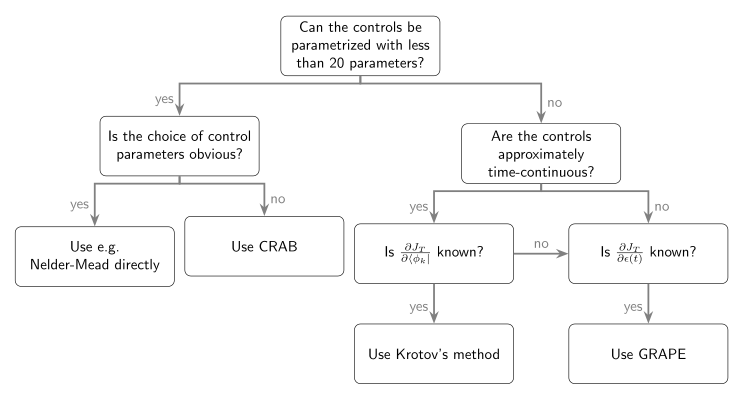

Other Optimization Methods
==========================

In the following, we compare Krotov's method to other numerical
optimization methods that have been used widely in quantum control, with
an emphasis on methods that have been implemented as open source
software.

.. _IterativeSchemes:

Iterative schemes from variational calculus
-------------------------------------------

Gradient-based optimal control methods derive the condition for the
optimal control field from the application of the variational principle
to the optimization functional in
Eq. :eq:`functional`. Since the functional depends
both on the states and the control field, it is necessary to include the
equation of motion (Schrödinger or Liouville-von-Neumann) as a
constraint. That is, the states :math:`\{\ket{\phi_k}\}` must be
compatible with the equation of motion under the control fields
:math:`\{\epsilon_l(t)\}`. In order to convert the constrained
optimization problem into an unconstrained one, the equation of motion
is included in the functional with the co-states :math:`\ket{\chi_k(t)}`
as Lagrange
multipliers :cite:`KosloffCP1989,ShiJCP1990,ShiCPC1991,Tannor91`.

The necessary condition for an extremum becomes :math:`\delta J = 0` for
this extended functional. Evaluation of the extremum condition results
in :cite:`Tannor91`

.. math::
   :label: variational_update

   \Delta \epsilon_l(t) \propto \frac{\delta J}{\delta \epsilon_l} \propto
       \Im \big\langle
       \chi_k(t)
       \big\vert
       \Op{\mu}
       \big\vert
       \phi_k(t)
       \big\rangle\,,

where :math:`\Op{\mu} = \partial \Op{H} / \partial \epsilon_l(t)` is
the operator coupling to the field :math:`\epsilon_l(t)`.
Equation :eq:`variational_update` is both
continuous in time and implicit in :math:`\epsilon_l(t)` since the
states :math:`\ket{\phi_k(t)}`, :math:`\ket{\chi_k(t)}` also depend on
:math:`\epsilon_l(t)`. Numerical solution of
Eq. :eq:`variational_update` thus requires
an iterative scheme and a choice of time discretization.

The most intuitive time-discretization yields a *concurrent* update
scheme :cite:`Tannor91,Tannor92,SomloiCP1993`,

.. math::
   :label: concurrent_update

   \Delta \epsilon_l^{(i)}(t) \propto
       \Im \big\langle
       \chi_k^{(i-1)}(t)
       \big\vert
       \Op{\mu}
       \big\vert
       \phi_k^{(i-1)}(t)
       \big\rangle\,.

Here, at iterative step :math:`(i)`, the backward-propagated co-states
:math:`\{\ket{\chi_k(t)}\}` and the forward-propagated states
:math:`\{\ket{\phi_k(t)}\}` both evolve under the 'guess’ controls
:math:`\epsilon^{(i-1)}_l(t)` of that iteration. Thus, the update is
determined entirely by information from the previous iteration and can
be evaluated at each point :math:`t` independently. However, this scheme
does not guarantee monotonic convergence, and requires a line search to
determine the appropriate magnitude of the pulse
update :cite:`Tannor91`.

A further ad-hoc modification of the
functional :cite:`ZhuJCP98` allows to formulate a family of
update schemes that do guarantee monotonic
convergence :cite:`MadayJCP2003,OhtsukiJCP2004`. These
schemes introduce separate fields :math:`\{\epsilon_l(t)\}` and
:math:`\{\tilde\epsilon_l(t)\}` for the forward and backward
propagation, respectively, and use the update
scheme :cite:`WerschnikJPB2007`

.. math::
   :label: zhu_rabitz_update

   \begin{aligned}
       \epsilon_l^{(i)}(t)
         & = (1-\delta) \tilde\epsilon_l^{(i-1)}(t) - \frac{\delta}{\alpha}
         \Im \big\langle
           \chi_k^{(i-1)}(t)
           \big\vert
           \Op{\mu}
           \big\vert
           \phi_k^{(i)}(t)
           \big\rangle \\
       \tilde\epsilon_l^{(i)}(t)
         & = (1-\eta) \epsilon_l^{(i-1)}(t) - \frac{\eta}{\alpha}
         \Im \big\langle
           \chi_k^{(i)}(t)
           \big\vert
           \Op{\mu}
           \big\vert
           \phi_k^{(i)}(t)
           \big\rangle\,,
     \end{aligned}

with :math:`\delta, \eta \in [0, 2]` and an arbitrary step width
:math:`\alpha`. For the control of wavepacket dynamics, an
implementation of this generalized class of algorithms is available in
the `WavePacket Matlab package`_ :cite:`SchmidtCPC2018`.

.. _WavePacket Matlab package: https://sourceforge.net/p/wavepacket/wiki/Home/

.. _ComparisonKrotov:

Krotov's method
---------------

The method developed by
Krotov :cite:`KrotovEC1983,KrotovCC1988,Krotov.book,KonnovARC99`
and later translated to the language of quantum control by Tannor and
coworkers :cite:`Tannor92,SomloiCP1993,BartanaJCP1997,SklarzPRA2002,ReichJCP12`
takes a somewhat unintuitive approach to disentangle the interdependence
of field and states by adding a zero to the functional. This allows to
*construct* an updated control field that is guaranteed to lower the
value of the functional, resulting in monotonic convergence. The full
method is described in :ref:`KrotovsMethod`, but its essence
can be boiled down to the update in each iteration :math:`(i)`,
Eq. :eq:`update`, taking the form

.. math::
   :label: sequential_update

   \Delta \epsilon_l^{(i)}(t) \propto
       \Im \big\langle
       \chi_k^{(i-1)}(t)
       \big\vert
       \Op{\mu}
       \big\vert
       \phi_k^{(i)}(t)
       \big\rangle\,,

with co-states :math:`\ket{\chi_k(t)^{(i-1)}}` backward-propagated
under the *guess* controls :math:`\{\epsilon_l^{(i-1)}(t)\}` and the
states :math:`\ket{\phi^{(i)}_k(t)}` forward-propagated under the
*optimized* controls :math:`\{\epsilon_l^{(i)}(t)\}`. Compared to the
*concurrent* form of
Eq. :eq:`concurrent_update`, the Krotov
update scheme is *sequential*: The update at time :math:`t` depends on
the states forward-propagated using the updated controls at all previous
times, see :ref:`TimeDiscretization`
for details.

It is worth noting that the sequential update can be recovered as a
limiting case of the monotonically convergent class of algorithms in
Eq. :eq:`zhu_rabitz_update`, for
:math:`\delta = 1`, :math:`\eta = 0`. This may explain why parts of the
quantum control community consider *any* sequential update scheme as
"Krotov's method" :cite:`SchirmerNJP2011,MachnesPRA11`.
However, following Krotov's
construction :cite:`KrotovEC1983,KrotovCC1988,Krotov.book,KonnovARC99`
requires no ad-hoc modification of the functional and can thus be
applied more generally. In particular, as discussed in
:ref:`SecondOrderUpdate`, a second-order construction can address non-convex
functionals.

In all its
variants :cite:`Tannor92,SomloiCP1993,BartanaJCP1997,SklarzPRA2002,ReichJCP12`,
Krotov's method is a first-order gradient with respect to the control
fields (even in the second-order construction which is second order only
with respect to the states). As the optimization approaches the optimum,
this gradient can become very small, resulting in slow convergence. It
is possible to extend Krotov's method to take into account information
from the quasi-Hessian :cite:`EitanPRA11`. However, this
"K-BFGS" variant of Krotov's method is a substantial extension to the
procedure as described in :ref:`KrotovsMethod`, and is currently not
supported by the :mod:`krotov` package.

The update Eq. :eq:`sequential_update` is
specific to the running cost in Eq. :eq:`g_a`. In most of
the :ref:`IterativeSchemes`, a constraint
on the *pulse fluence* is used instead. Formally, this is also
compatible with Krotov's method, by choosing
:math:`\epsilon_{l, \text{ref}}^{(i)}(t) \equiv 0` in
Eq. :eq:`g_a` :cite:`PalaoPRL2002`. It turns
the *update* equations :eq:`sequential_update`, :eq:`concurrent_update`
into *replacement* equations, with :math:`\epsilon_l^{(i)}(t)` on the
left-hand side instead of :math:`\Delta\epsilon_l^{(i)}(t)`,
cf. Eq. :eq:`zhu_rabitz_update` for
:math:`\delta = 1`, :math:`\eta = 0`. In our experience, this leads to
numerical instability and should be avoided. A mixture of *update* and
*replacement* is possible when a penalty of the pulse fluence is
necessary :cite:`GoerzPhd2015`.

.. _GRAPE:

GRadient Ascent Pulse Engineering (GRAPE)
-----------------------------------------

While the monotonically convergent methods based on variational calculus
must "guess" the appropriate time discretization, and Krotov's method
finds the sequential time discretization by a clever construction, the
GRAPE method sidesteps the problem by discretizing the functional
*first*, before applying the variational calculus.

Specifically, we consider the piecewise-constant discretization of the
dynamics onto a time grid, where the final time states
:math:`\{\ket{\phi_k^{(i-1)}(T)}\}` resulting from the time evolution of
the initial states :math:`\{\ket{\phi_k}\}` under the guess controls
:math:`\epsilon^{(i-1)}_n` in iteration :math:`(i)` of the optimization
are obtained as

.. math::
   :label: discrete_time_evolution

   \ket{\phi^{(i-1)}_k(T)} = \Op{U}^{(i-1)}_{N_T} \dots
   \Op{U}^{(i-1)}_{n} \dots \Op{U}^{(i-1)}_{1} \big\vert \phi_k \big\rangle\,,

where :math:`\Op{U}^{(i-1)}_{n}` is the time evolution operator on the
time interval :math:`n` in Hilbert space,

.. math::

   \Op{U}^{(i-1)}_{n} = \exp\Bigg[ -\frac{\mathrm{i}}{\hbar} \Op{H}\big(
   \underbrace{\epsilon^{(i-1)}(\tilde t_{n-1})}_{\epsilon^{(i-1)}_n} \big) \dd
   t\Bigg];\qquad \tilde{t}_n \equiv t_n + \dd t / 2\,.

The independent control parameters are now the scalar values
:math:`\epsilon_n`, respectively :math:`\epsilon_{ln}` if there are
multiple control fields indexed by :math:`l`.

The GRAPE method looks at the direct gradient
:math:`\partial J/\partial \epsilon_n` and updates each control
parameter in the direction of that
gradient :cite:`KhanejaJMR05`. The step width must be
determined by a line search.

Typically, only the final time functional :math:`J_T` has a nontrivial
gradient. For simplicity, we assume that :math:`J_T` can be expressed in
terms of the complex overlaps :math:`\{\tau_k\}` between the target
states :math:`\{\ket{\phi_k^{\tgt}}\}` and the propagated states
:math:`\{\ket{\phi_k(T)}\}`, as e.g. in
Eqs. :eq:`JTss`, :eq:`JTre`. Using Eq. :eq:`discrete_time_evolution`
leads to

.. math::
   :label: gradient

   \begin{split}
     \frac{\partial \tau_k}{\partial \epsilon_n} &= \frac{\partial}{\partial
     \epsilon_n} \big\langle \phi_k^{\tgt} \big\vert \Op{U}^{(i-1)}_{N_T} \dots
     \Op{U}^{(i-1)}_{n} \dots \Op{U}^{(i-1)}_{1} \big\vert \phi_k \big\rangle \\
     &=
         \underbrace{%
     \big\langle \phi_k^{\tgt} \big\vert
               \Op{U}^{(i-1)}_{N_T} \dots \Op{U}^{(i-1)}_{n+1}}_{%
     \bra{\chi^{(i-1)}_k(t_{n+1})} } \,
     \frac{\partial\Op{U}^{(i-1)}_{n}}{\partial\epsilon_n} \,
          \underbrace{%
     \Op{U}^{(i-1)}_{n-1} \dots \Op{U}^{(i-1)}_{1} \big\vert
             \phi_k \big\rangle}_{%
     \ket{\phi^{(i-1)}_k(t_n)} }\
   \end{split}

as the gradient of these overlaps. The gradient for :math:`J_T`,
respectively :math:`J` if there are additional running costs then
follows from the chain rule. The numerical evaluation of
Eq. :eq:`gradient` involves the backward-propagated
states :math:`\ket{\chi_k(t_{n+1})}` and the forward-propagated states
:math:`\ket{\phi_k(t_n)}`. As only states from iteration :math:`(i-1)`
enter in the gradient, GRAPE is a *concurrent* scheme.

The comparison of the sequential update
equation :eq:`sequential_update` of
Krotov's method and the concurrent update
equation :eq:`concurrent_update` has
inspired a sequential evaluation of the "gradient", modifying the
right-hand side of Eq. :eq:`gradient` to
:math:`\langle \chi_k^{(i-1)}(t_{n+1})
\vert \partial_\epsilon U_n^{(i-1)} \vert \phi_k^{(i)}(t_n)\rangle`.
That is, the states :math:`\{\ket{\phi_k(t)}\}` are forward-propagated
under the optimized field :cite:`SchirmerJMO2009`. This can
be generalized to "hybrid" schemes that interleave concurrent and
sequential calculation of the gradient :cite:`MachnesPRA11`.
An implementation of the concurrent/sequential/hybrid gradient is
available in the `DYNAMO Matlab package`_ :cite:`MachnesPRA11`.
The sequential gradient scheme is sometimes referred to as
"Krotov-type" :cite:`MachnesPRA11,FloetherNJP12`. To avoid
confusion with the specific method defined in
:ref:`KrotovsMethod`, we prefer the name "sequential GRAPE".

GRAPE does not give a guarantee of monotonic convergence. As the
optimization approaches the minimum of the functional, the first order
gradient is generally insufficient to drive the optimization
further :cite:`EitanPRA11`. To remedy this, a numerical
estimate of the Hessian :math:`\partial^2 J_T/\partial
\epsilon_j \partial \epsilon_{j^\prime}` should also be included in the
calculation of the update. The `L-BFGS-B`_ quasi-Newton
method :cite:`ByrdSJSC1995,ZhuATMS97` is most commonly used
for this purpose, resulting in the "Second-order
GRAPE" :cite:`FouquieresJMR2011` or "GRAPE-LBFGS” method.
`L-BFGS-B`_ is implemented as a Fortran
library :cite:`ZhuATMS97` and widely available, e.g. wrapped
in optimization toolboxes like SciPy_ :cite:`Scipy`. This
means that it can be easily added as a "black box" to an existing
gradient optimization. As a result, augmenting GRAPE with a
quasi-Hessian is essentially "for free". Thus, we always mean GRAPE to
refer to GRAPE-LBFGS. Empirically, GRAPE-LBFGS *usually* converges
monotonically.

Thus, for (discretized) time-continuous controls, both GRAPE and
Krotov's method can generally be used interchangeably. Historically,
Krotov's method has been used primarily in the control of molecular
dynamics, while GRAPE has been popular in the NMR community. Some
potential benefits of Krotov's method compared to GRAPE
are :cite:`EitanPRA11`:

-  Krotov's method mathematically guarantees monotonic convergence in
   the continuous-time limit. There is no line-search required for the
   step width :math:`1 / \lambda_{a, l}`.

-  The sequential nature of Krotov's update scheme, with information
   from earlier times entering the update at later times within the same
   iteration, results in faster convergence than the concurrent update
   in GRAPE :cite:`MachnesPRA11,JaegerPRA14`. This advantage
   disappears as the optimization approaches the
   optimum :cite:`EitanPRA11`.

-  The choice of functional :math:`J_T` in Krotov's method only enters
   in the boundary condition for the backward-propagated states,
   Eq. :eq:`chi_boundary`, while the update
   equation stays the same otherwise. In contrast, for functionals
   :math:`J_T` that do not depend trivially on the
   overlaps :cite:`NevesJMR2009,NguyenJMR2017,AnselPRA2017,SpindlerJMR2012,TosnerACIE2018`,
   the evaluation of the gradient in GRAPE may deviate significantly
   from its usual form, requiring a problem-specific implementation from
   scratch. This may be mitigated by the use of automatic
   differentiation in future
   implementations :cite:`LeungPRA2017,AbdelhafezPRA2019`.

GRAPE has a significant advantage if the controls are not
time-continuous, but are *physically* piecewise constant ("bang-bang
control"). The calculation of the GRAPE-gradient is unaffected by this,
whereas Krotov's method can break down when the controls are not
approximately continuous. QuTiP contains an implementation of GRAPE
limited to this use case.

Variants of gradient-ascent can be used to address *pulse
parametrizations*. That is, the control parameters may be arbitrary
parameters of the control field (e.g., spectral coefficients) instead of
the field amplitude :math:`\epsilon_n` in a particular time interval.
This is often relevant to design control fields that meet experimental
constraints. One possible realization is to calculate the gradients for
the control parameters from the gradients of the time-discrete control
amplitudes via the chain
rule :cite:`WinckelIP2008,SkinnerJMR2010,MotzoiPRA2011,LucarelliPRA2018`.
This approach
has recently been named "GRadient Optimization Using Parametrization"
(GROUP) :cite:`SorensenPRA2018`.
An implementation of several variants of GROUP is available in the
QEngine C++ library :cite:`SorensenCPC2019`.
An alternative for a
moderate number of control parameters is "gradient-optimization of
analytic controls" (GOAT) :cite:`MachnesPRL2018`. GOAT
evaluates the relevant gradient with forward-mode differentiation; that
is, :math:`{\partial \tau_k}/{\partial \epsilon_n}` is directly
evaluated alongside :math:`\tau_k`. For :math:`N = \Abs{\{\epsilon_m\}}`
control parameters, this implies :math:`N` forward propagations of the
state-gradient pair per iteration. Alternatively, the :math:`N`
propagations can be concatenated into a single propagation in a Hilbert
space enlarged by a factor :math:`N` (the original state paired with
:math:`N` gradients).

A benefit of GOAT over the more general GROUP is that it does not
piggy-back on the piecewise-constant discretization of the control
field, and thus may avoid the associated numerical error. This allows to
optimize to extremely high fidelities as required for some error
correction protocols :cite:`MachnesPRL2018`.

.. _SciPy: https://www.scipy.org
.. _DYNAMO Matlab package: https://github.com/shaimach/Dynamo
.. _L-BFGS-B: https://docs.scipy.org/doc/scipy/reference/optimize.minimize-lbfgsb.html

.. _GrapeInQutip:

GRAPE in QuTiP
--------------

An implementation of GRAPE is included in QuTiP, see the `section on Quantum
Optimal Control in the QuTiP docs`_.  It is used via the
:func:`qutip.control.pulseoptim.optimize_pulse` function.
However, some of the design choices in QuTiP's GRAPE effectively limit
the routine to applications with physically piecewise-constant pulses (where
GRAPE has an advantage over Krotov's method, as discussed in the previous
section).

For discretized time-continuous pulses, the implementation of Krotov's method
in :func:`.optimize_pulses` has the following advantages over
:func:`qutip.control.pulseoptim.optimize_pulse`:

* Krotov's method can optimize for more than one control field at the same time
  (hence the name of the routine :func:`.optimize_pulses` compared to
  :func:`~qutip.control.pulseoptim.optimize_pulse`).
* Krotov's method optimizes a list of :class:`.Objective` instances
  simultaneously. The optimization for multiple simultaneous objectives in
  QuTiP's GRAPE implementation is limited to optimizing a quantum gate. Other
  uses of simultaneous objectives, such as optimizing for robustness, are not
  available.
* Krotov's method can start from an arbitrary set of guess controls. In the
  GRAPE implementation, guess pulses can only be chosen from a specific set of
  options (including "random"). Again, this makes sense for a control field
  that is piecewise constant with relatively few switching points, but is very
  disadvantageous for time-continuous controls.
* Krotov's method has complete flexibility in which propagation method is used
  (via the `propagator` argument to :func:`.optimize_pulses`), while QuTiP's
  GRAPE only allows to choose between fixed number of methods for
  time-propagation. Supplying a problem-specific propagator is not possible.

Thus, QuTiP's GRAPE implementation and the implementation of Krotov's method in
this package complement each other, but will not compare directly.

.. _section on Quantum Optimal Control in the QuTiP docs: http://qutip.org/docs/latest/guide/guide-control.html

.. _GradientFreeOptimization:

Gradient-free optimization
--------------------------

In situations where the problem can be reduced to a relatively small
number of control parameters (typically less than :math:`\approx20`,
although this number may be pushed to :math:`\approx50` by sequential
increase of the number of parameters and
re-parametrization :cite:`RachPRA2015,GoetzPRA2016`),
gradient-free optimization becomes feasible. The most straightforward
use case are controls with an analytic shape (e.g. due to the
constraints of an experimental setup), with just a few free parameters.
As an example, consider control pulses that are restricted to a Gaussian
shape, so that the only free parameters are peak amplitude, pulse width
and delay. The control parameters are not required to be parameters of a
time-dependent control, but may also be static parameters in the
Hamiltonian, e.g. the polarization of the laser beams utilized in an
experiment :cite:`HornNJP2018`.

A special case of gradient-free optimization is the Chopped RAndom Basis
(CRAB) method :cite:`DoriaPRL11,CanevaPRA2011`. The essence
of CRAB is in the specific choice of the parametrization in terms of a
low-dimensional *random* basis, as the name implies. Thus, it can be
used when the parametrization is not pre-defined as in the case of
direct free parameters in the pulse shape discussed above. The
optimization itself is normally performed by Nelder-Mead simplex based
on this parametrization, although any other gradient-free method could
be used as well. An implementation of CRAB is available in QuTiP, see `QuTiP's
documentation of CRAB`_, and uses the same
:func:`qutip.control.pulseoptim.optimize_pulse`
interface as the GRAPE method discussed above (:ref:`GrapeInQutip`) with the
same limitations.
CRAB is prone to getting stuck in local minima of the optimization landscape.
To remedy this, a variant of CRAB, "dressed CRAB" (DCRAB) has been
developed :cite:`RachPRA2015` that re-parametrizes the controls when this
happens.

Gradient-free optimization does not require backward propagation, only
forward propagation of the initial states and evaluation of the
optimization functional :math:`J`. The functional is not required to be
analytic. It may be of a form that does not allow calculation of the
gradients :math:`\partial
J_T / \partial \bra{\phi_k}` (Krotov's method) or
:math:`\partial J / \partial
\epsilon_j` (GRAPE). The optimization also does not require any storage
of states. However, the number of iterations can grow extremely large,
especially with an increasing number of control parameters. Thus, an
optimization with a gradient-free method is not necessarily more
efficient overall compared to a gradient-based optimization with much
faster convergence. For only a few parameters, however, it can be highly
efficient. This makes gradient-free optimization useful for
"pre-optimization", that is, for finding guess controls that are then
further optimized with a gradient-based
method :cite:`GoerzEPJQT2015`.

Generally, gradient-free optimization can be easily realized directly in
QuTiP or any other software package for the simulation of quantum
dynamics:

-  Write a function that takes an array of optimization parameters as
   input and returns a figure of merit. This function would, e.g.,
   construct a numerical control pulse from the control parameters,
   simulate the dynamics using qutip.mesolve.mesolve, and evaluate a
   figure of merit (like the overlap with a target state).

-  Pass the function to scipy.optimize.minimize for gradient-free
   optimization.

The implementation in :func:`scipy.optimize.minimize` allows to choose between
different optimization methods, with Nelder-Mead simplex being the
default. There exist also more advanced optimization methods available
in packages like NLopt_ :cite:`NLOpt` or
Nevergrad_ :cite:`nevergrad` that may be worth exploring for
improvements in numerical efficiency and additional functionality such
as support for non-linear constraints.

.. _Subplex: https://nlopt.readthedocs.io/en/latest/NLopt_Algorithms/#sbplx-based-on-subplex
.. _NLopt: https://nlopt.readthedocs.io/
.. _Nevergrad: https://github.com/facebookresearch/nevergrad
.. _QuTiP's documentation of CRAB: http://qutip.org/docs/latest/guide/guide-control.html#the-crab-algorithm

.. _choosing-an-optimization-method:

Choosing an optimization method
-------------------------------

.. _figoctdecisiontree:

   Decision tree for the choice of a numerical open-loop
   optimization method.
   The choice of control method is most directly associated with the number of
   control parameters (:math:`n`).
   For "piecewise-constant controls", the control
   parameters are the values of the control field in each time interval.
   For "analytical" controls, we assume that the control fields are
   described by a fixed analytical formula parametrized by the control
   parameters. The "non-analytical" controls for CRAB refer to the
   *random* choice of a fixed number of spectral components, where the
   control parameters are the coefficients for those spectral
   components. Each method in the diagram is meant to include all its
   variants, a multitude of gradient-free methods and e.g. DCRAB for
   CRAB, GRAPE-LBFGS and sequential/hybrid gradient-descent for GRAPE,
   and K-BFGS for Krotov's method, see text for detail.

In the following, we discuss some of the concerns in the choice of
optimization methods. The discussion is limited to iterative open-loop
methods, where the optimization is based on a numerical simulation of
the dynamics. It excludes analytical control methods such as geometric
control, closed-loop methods, or coherent feedback control; see
Ref. :cite:`PetersenIETCTA2010` for an overview.

Whether to use a gradient-free optimization method, GRAPE, or Krotov's
method depends on the size of the problem, the requirements on the
control fields, and the mathematical properties of the optimization
functional. Gradient-free methods should be used if the number of
independent control parameters is smaller than :math:`\approx 20`, or
the functional is of a form that does not allow to calculate gradients
easily. It is always a good idea to use a gradient-free method to obtain
improved guess pulses for use with a gradient-based
method :cite:`GoerzEPJQT2015`.

GRAPE or its variants should be used if the control parameters are
discrete, such as on a coarse-grained time grid, and the derivative of
:math:`J` with respect to each control parameter is easily computable.
Note that the implementation provided in QuTiP is limited to
state-to-state transitions and quantum gates, even though the method is
generally applicable to a wider range of objectives.

When the control parameters are general analytic coefficients instead of
time-discrete amplitudes, the
GROUP :cite:`SkinnerJMR2010,MotzoiPRA2011,SorensenPRA2018` or
GOAT :cite:`MachnesPRL2018` variant of gradient-ascent may
be a suitable choice. GOAT in particular can avoid the numerical error
associated with time discretization. However, as the method scales
linearly in memory and/or CPU with the number of control parameters,
this is best used when then number of parameters is below 100.

Krotov's method should be used if the control is close to
time-continuous, and if the derivative of :math:`J_T` with respect to
the states, Eq. :eq:`chi_boundary`, can be
calculated. When these conditions are met, Krotov's method gives
excellent convergence. The general family of monotonically convergent
iteration schemes :cite:`MadayJCP2003` may also be used.

The decision tree in :numref:`figoctdecisiontree` can guide the
choice of an optimization method. The key deciding factors are the
number of control parameters (:math:`n`) and whether the controls are time-discrete.
Of course, the parametrization of the controls is itself a choice.
Sometimes, experimental constraints only allow controls that depend on a
small number of tunable parameters. However, this necessarily limits the
exploration of the full physical optimization landscape. At the other
end of the spectrum, arbitrary time-continuous controls such as those
assumed in Krotov's method have no inherent constraints and are
especially useful for more fundamental tasks, such as mapping the design
landscape of a particular system :cite:`GoerzNPJQI2017` or
determining the quantum speed limit, i.e., the minimum time in which the
system can reach a given target :cite:`CanevaPRL09,GoerzJPB11,SorensenNat16`.
